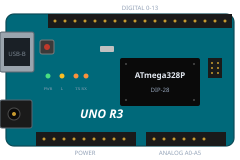
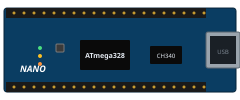
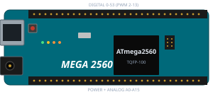
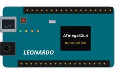
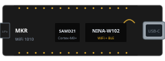
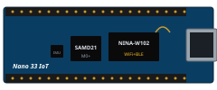

# Płytki Arduino — rodzina, pinouty, jak wybrać

**Arduino** to jednocześnie marka, otwarty standard sprzętu i bezpłatne środowisko programistyczne. Każda „arduinka" to po prostu **płytka z mikrokontrolerem** wyposażona w wygodny układ USB do programowania, listwy pinów, regulator napięcia i diody sygnalizacyjne. „Magia" Arduino polega na tym, że na *każdej* płytce uruchomisz ten sam program (sketch), zmieniając w IDE tylko model — biblioteki załatwiają różnice.

## Galeria — najczęściej kupowane płytki

Arduino Uno R3

8-bit · 5V · 14D/6A · USB-B

35–90 zł

Arduino Nano

8-bit · 5V · breadboard · mini-USB

15–40 zł

Mega 2560

54D/16A · 4× UART · 256KB

70–140 zł

Leonardo

native USB HID · klawiatura

50–100 zł

MKR WiFi 1010

3,3V · WiFi+BLE · IoT

180–280 zł

Nano 33 IoT

WiFi+BLE+IMU · breadboard

130–220 zł

## Rodzina płytek — szybkie porównanie

| Płytka | Mikrokontroler | Napięcie logiczne | Flash | RAM | Cyfrowe / Analogowe | USB | Komunikacja | Cena (PLN) |
|--------|----------------|-------------------|-------|-----|---------------------|-----|-------------|------------|
| **Uno R3** | ATmega328P (8-bit, 16 MHz) | 5 V | 32 KB | 2 KB | 14 / 6 | typ B | UART, I2C, SPI | 35–90 |
| **Uno R4 Minima** | Renesas RA4M1 (32-bit, 48 MHz) | 5 V | 256 KB | 32 KB | 14 / 6 | USB-C | UART, I2C, SPI, CAN, DAC | 90–140 |
| **Uno R4 WiFi** | RA4M1 + ESP32-S3 | 5 V | 256 KB | 32 KB | 14 / 6 | USB-C | + WiFi, BT, matryca LED 12×8 | 130–190 |
| **Nano** (klasyczne) | ATmega328P | 5 V | 32 KB | 2 KB | 14 / 8 | mini/micro USB | UART, I2C, SPI | 15–40 |
| **Nano Every** | ATmega4809 | 5 V | 48 KB | 6 KB | 14 / 8 | micro USB | UART, I2C, SPI | 40–80 |
| **Pro Mini** | ATmega328P | 3,3 V *lub* 5 V | 32 KB | 2 KB | 14 / 8 | brak (FTDI) | UART, I2C, SPI | 8–25 |
| **Mega 2560** | ATmega2560 | 5 V | 256 KB | 8 KB | **54 / 16** | typ B | 4× UART, I2C, SPI | 70–140 |
| **Leonardo** | ATmega32u4 | 5 V | 32 KB | 2,5 KB | 20 / 12 | micro USB | UART, I2C, SPI, **HID** | 50–100 |
| **Micro** | ATmega32u4 | 5 V | 32 KB | 2,5 KB | 20 / 12 | micro USB | jw. + HID | 40–90 |
| **Due** | SAM3X8E (ARM Cortex-M3) | **3,3 V** | 512 KB | 96 KB | 54 / 12 | micro USB | 4× UART, I2C, SPI, CAN, DAC | 130–230 |
| **MKR WiFi 1010** | SAMD21 + ESP32-WROOM | 3,3 V | 256 KB | 32 KB | 8 / 7 | micro USB | WiFi, BLE, I2C, SPI | 180–280 |
| **MKR Zero** | SAMD21 | 3,3 V | 256 KB | 32 KB | 8 / 7 | micro USB | I2S (audio), slot SD | 130–200 |
| **Nano 33 IoT** | SAMD21 + NINA-W102 (ESP32) | 3,3 V | 256 KB | 32 KB | 14 / 8 | micro USB | WiFi, BLE, IMU LSM6DS3 | 130–220 |
| **Nano 33 BLE Sense** | nRF52840 | 3,3 V | 1 MB | 256 KB | 14 / 8 | micro USB | BLE, IMU, mikrofon, temp/wilg, gest, kolor | 200–340 |
| **Nano RP2040 Connect** | RP2040 + NINA | 3,3 V | 16 MB | 264 KB | 20 / 8 | USB-C | WiFi, BLE, IMU, mikrofon | 130–200 |
| **Portenta H7** | STM32H747 (M7+M4) | 3,3 V | 2 MB + 16 MB ext. | 1 MB | 14 / 8 | USB-C | WiFi, BLE, GPU, audio | 600–900 |

> **Reguła kciuka dla początkującego:** zacznij od **Uno R3** (lub klona Nano) — najtańsze, 5 V tolerujące większość modułów z AliExpress/Botland, ogromna biblioteka tutoriali. Resztę kupuj wtedy, gdy *konkretnie* zabraknie ci czegoś, czego Uno nie ma (pinów → Mega, WiFi → R4 WiFi/MKR, HID → Leonardo).

## Arduino Uno R3 — wzorzec, na którym opiera się reszta

Uno to *de facto* lingua franca Arduino — większość tutoriali, schematów i shieldów przygotowano właśnie pod tę płytkę. Warto zapamiętać jej pinout, bo Nano i Pro Mini to ta sama architektura w mniejszej obudowie.

<svg viewBox="0 0 720 320" xmlns="http://www.w3.org/2000/svg" role="img" aria-label="Schematyczny pinout Arduino Uno R3 - listwy power, analog, digital i USB">
<rect x="40" y="50" width="640" height="220" rx="14" fill="#143527" stroke="#4ade80" stroke-width="2"/>
<text x="360" y="40" text-anchor="middle" font-family="Segoe UI,sans-serif" font-size="13" fill="#a78bfa" font-weight="700">ARDUINO UNO R3 (widok z góry — uproszczony)</text>
<!-- USB i zasilanie -->
<rect x="20" y="80" width="40" height="50" fill="#1e293b" stroke="#94a3b8"/>
<text x="40" y="155" text-anchor="middle" font-size="10" fill="#94a3b8">USB-B</text>
<rect x="20" y="200" width="40" height="40" fill="#1e293b" stroke="#94a3b8"/>
<text x="40" y="260" text-anchor="middle" font-size="10" fill="#94a3b8">DC 7-12V</text>
<!-- Power pins (dol lewa) -->
<rect x="70" y="240" width="220" height="20" fill="#0f172a" stroke="#fb923c"/>
<text x="180" y="280" text-anchor="middle" font-size="11" fill="#fb923c" font-weight="700">POWER: IOREF · RESET · 3.3V · 5V · GND · GND · Vin</text>
<!-- Analog pins (dol prawa) -->
<rect x="320" y="240" width="280" height="20" fill="#0f172a" stroke="#60a5fa"/>
<text x="460" y="280" text-anchor="middle" font-size="11" fill="#60a5fa" font-weight="700">ANALOG IN: A0 · A1 · A2 · A3 · A4(SDA) · A5(SCL)</text>
<!-- Digital pins (gora prawa, 8-13 + AREF/GND/SDA/SCL) -->
<rect x="320" y="60" width="340" height="20" fill="#0f172a" stroke="#f472b6"/>
<text x="490" y="98" text-anchor="middle" font-size="11" fill="#f472b6" font-weight="700">DIGITAL: SCL · SDA · AREF · GND · 13(SCK) · 12(MISO) · 11(MOSI,PWM~) · 10(SS,PWM~) · 9(PWM~) · 8</text>
<!-- Digital pins (gora lewa, 0-7) -->
<rect x="70" y="60" width="220" height="20" fill="#0f172a" stroke="#f472b6"/>
<text x="180" y="98" text-anchor="middle" font-size="11" fill="#f472b6" font-weight="700">DIGITAL: 7 · 6(~) · 5(~) · 4 · 3(~) · 2 · 1(TX) · 0(RX)</text>
<!-- ICSP / mikrokontroler -->
<rect x="290" y="120" width="120" height="90" rx="6" fill="#1e293b" stroke="#a78bfa" stroke-width="1.5"/>
<text x="350" y="155" text-anchor="middle" font-size="12" fill="#a78bfa" font-weight="700">ATmega328P</text>
<text x="350" y="172" text-anchor="middle" font-size="10" fill="#a394b3">16 MHz · 32KB Flash</text>
<text x="350" y="187" text-anchor="middle" font-size="10" fill="#a394b3">2KB RAM · 1KB EEPROM</text>
<!-- LEDy -->
<circle cx="540" cy="135" r="6" fill="#fbbf24"/><text x="540" y="118" text-anchor="middle" font-size="9" fill="#a394b3">L (pin 13)</text>
<circle cx="565" cy="135" r="6" fill="#4ade80"/><text x="565" y="118" text-anchor="middle" font-size="9" fill="#a394b3">PWR</text>
<circle cx="590" cy="135" r="6" fill="#fb923c"/><circle cx="610" cy="135" r="6" fill="#fb923c"/><text x="600" y="118" text-anchor="middle" font-size="9" fill="#a394b3">TX/RX</text>
<!-- Reset button -->
<rect x="100" y="120" width="35" height="35" fill="#1e293b" stroke="#f87171" stroke-width="1.5"/>
<text x="118" y="170" text-anchor="middle" font-size="10" fill="#f87171">RESET</text>
<!-- ICSP -->
<rect x="555" y="200" width="30" height="20" fill="#1e293b" stroke="#94a3b8"/>
<text x="570" y="232" text-anchor="middle" font-size="9" fill="#a394b3">ICSP</text>
</svg>

### Co który pin robi

| Grupa | Piny | Funkcja |
|-------|------|---------|
| **Power** | IOREF, RESET, 3.3V, 5V, GND ×2, Vin | Zasilanie modułów (5V/3.3V), wspólna masa, sygnał RESET |
| **Digital 0–13** | D0–D13 | Wejście/wyjście 0/1 (5 V). **D0/D1** to też UART (RX/TX) używany przez USB |
| **PWM (~)** | D3, D5, D6, D9, D10, D11 | Wyjścia z modulacją szerokości impulsu — analogWrite (0–255) |
| **SPI** | D10 (SS), D11 (MOSI), D12 (MISO), D13 (SCK) | Magistrala do wyświetlaczy, SD, RFID |
| **I2C** | A4 (SDA), A5 (SCL) | Magistrala dwuprzewodowa — czujniki, OLED, RTC |
| **Analog A0–A5** | A0–A5 | ADC 10-bit (0–1023) — czujniki analogowe; mogą działać też jako cyfrowe |
| **AREF** | AREF | Zewnętrzne napięcie odniesienia dla ADC |
| **Interrupts** | D2, D3 | Sprzętowe przerwania (`attachInterrupt`) |
| **ICSP** | 6-pinowy złącze | Programator zewnętrzny, alternatywne piny SPI |

### Zasilanie Uno

Płytkę zasilisz na **trzy sposoby**:
1. **USB** (5 V z komputera/ładowarki) — najwygodniej przy programowaniu i prototypach.
2. **Gniazdo DC 7–12 V** (jack 2,1 mm, plus na środku) — typowy zasilacz wtyczkowy.
3. **Pin Vin** (7–12 V) — własne zasilanie (bateria, zasilacz LM2596). Można też dać 5 V wprost na pin **5V** (omija regulator, więc upewnij się, że źródło jest stabilne).

Płytka oddaje **5 V** (z regulatora, maks. ~500 mA) i **3,3 V** (maks. ~50 mA — bardzo mało!) na piny do zasilania zewnętrznych modułów. Cięższe odbiorniki (silniki, pompki, taśmy LED) zawsze zasilaj **osobno**, łącząc tylko masy.

> **Uwaga:** zasilanie 12 V mocno grzeje liniowy regulator Uno — przy długiej pracy szkoda płytki i prądu. Lepiej zasil 5 V z zewnętrznej przetwornicy.

## Arduino Nano — Uno w miniaturze

Ten sam ATmega328P, ten sam zestaw funkcji, ale w obudowie pasującej do **płytki stykowej (breadboard)** — to czyni Nano ulubieńcem do prototypów i finalnych projektów upchanych w obudowie. Klasyczne klony mają układ **CH340** (USB-Serial) — przy pierwszym podłączeniu Windows poprosi o sterownik. Oryginalne i niektóre droższe klony mają **FT232RL** (FTDI).

**Nano Every** to nowsza, kompatybilna pinowo wersja z ATmega4809 — szybsze, więcej pamięci, ale z drobnymi różnicami w peryferiach.

## Arduino Pro Mini — minimum

Najmniejsza i najtańsza klasyczna „arduinka": bez USB, bez listw pinów (lutujesz je sam), za to często **3,3 V** (lub 5 V) i niski pobór prądu. Świetna do projektów bateryjnych. Programujesz przez **konwerter USB-Serial FTDI/CH340** (osobny moduł za ~10 zł).

## Arduino Mega 2560 — gdy zabraknie pinów

ATmega2560 ma **54 piny cyfrowe (z czego 15 PWM)**, **16 analogowych**, **4 sprzętowe UART-y** i 256 KB Flash. Wybierasz Megę, gdy:
- sterujesz **wieloma silnikami / serwami / przekaźnikami** naraz,
- używasz dużego **wyświetlacza TFT** lub modułu Ethernet z dużą biblioteką,
- chcesz osobny port szeregowy do GPS-a, drugi do Bluetooth, trzeci do komputera.

Mega R3 jest **kompatybilna z większością shieldów** od Uno — układ pinów się zgadza.

## Arduino Leonardo i Micro — emulacja klawiatury/myszy

ATmega32u4 ma **wbudowany kontroler USB**, więc Leonardo/Micro może udawać **klawiaturę, mysz lub joystick** podłączony do komputera (`#include <Keyboard.h>`, `#include <Mouse.h>`). To otwiera projekty typu „makro pad", „programowalna klawiatura gamingowa", „pedały DIY do symulatora".

## Arduino Due — pierwsza 32-bitowa

Procesor **SAM3X8E (ARM Cortex-M3, 84 MHz)**, 512 KB Flash, 96 KB RAM, dwa **prawdziwe wyjścia DAC**, USB native. **Uwaga: piny pracują na 3,3 V** — podłączenie 5 V *spali* je bez ostrzeżenia. Do modułów 5 V użyj **konwertera poziomów** (rozdział 03).

## Linia MKR i Nano 33 — Arduino z WiFi i sensorami

To „nowoczesne" Arduino: 3,3 V, USB micro/USB-C, gotowe do **IoT** i ML.
- **MKR WiFi 1010 / Nano 33 IoT** — SAMD21 + moduł NINA (ESP32) z WiFi i BLE. Łączysz Arduino z chmurą i Home Assistant w jednej płytce.
- **MKR WAN 1310** — sieć **LoRaWAN** (zasięg kilometrów) do odległych czujników.
- **Nano 33 BLE Sense** — nRF52 z BLE, **9-osiowym IMU**, mikrofonem, czujnikami temp/wilg/ciśnienia, gest i koloru — gotowy „tinyML" w jednej kostce.

## Klony, kompatybilne i co kupować

Arduino jest *open source* — każdy może produkować zgodne płytki. Markety pełne są **klonów** za ułamek ceny oryginału:
- **Oryginał (arduino.cc)** — pełne wsparcie, pieniądze idą do fundacji Arduino, jakość najwyższa, certyfikaty.
- **Klon „1:1"** (np. Funduino, Elegoo, Keyestudio) — to samo PCB, ten sam mikrokontroler; USB-Serial najczęściej **CH340** (Windows wymaga sterownika, na Linuksie/macOS jest natywnie).
- **Klon „prawie 1:1"** — drobne zmiany (np. brak ICSP, inny LED) — w 95% przypadków bez znaczenia.

**Wybór:** do nauki spokojnie klon (10–30 zł), do produktu/długoletniego serwera oryginał. Na ESP32 (rozdział 02 robotic) klony są jeszcze taniej.

### Sterownik USB-Serial — najczęstszy „pierwszy problem"
Jeśli po podłączeniu Nano/klona nie pojawia się w Menedżerze urządzeń (Windows) — pobierz sterownik **CH340** od WCH (lub **CP2102** dla niektórych płytek). Na Linuksie zwykle wystarczy dodać użytkownika do grupy `dialout`.

## Gdzie kupować

| Sklep | Plusy | Minusy |
|-------|-------|--------|
| **Botland, Kamami, Abox** | Polskie, szybka wysyłka, faktura, wsparcie | Najdroższe |
| **Allegro** | Ogromny wybór, polskie sklepy, gwarancja | Mieszana jakość — patrz oceny |
| **AliExpress** | Najtaniej, ten sam asortyment | Wysyłka 2–4 tyg., bywa „chińskie" CH340 |
| **arduino.cc / dystrybutorzy** | Oryginały, certyfikaty, wsparcie producenta | Najdroższe (1,5–3× klon) |

> **Zestaw startowy** (Uno + przewody + płytka stykowa + kilkanaście modułów) kupisz za 100–180 zł — najtańszy próg wejścia w świat elektroniki.

---

➡️ Dalej: **[02 — Programowanie](02-programowanie.html)** — Arduino IDE, struktura sketcha i pierwszy działający kod.
