# Czujniki — katalog modułów wejściowych

Najciekawszy rozdział: kilkadziesiąt modułów, które „dają oczy" Arduino. Każdy w schemacie *Co mierzy → Jak podpiąć → Jak to przeczytać* z gotowym kodem do wklejenia. Ceny orientacyjne (PLN, 2026).

> **Wspólna zasada:** każdy moduł potrzebuje **wspólnej masy (GND)** z Arduino. Zasilanie — albo z pinu 5 V Arduino (małe moduły), albo zewnętrzne, jeśli moduł ciągnie więcej niż ~100 mA.

## Galeria czujników z cenami

<div style="display:grid;grid-template-columns:repeat(auto-fill,minmax(170px,1fr));gap:12px;margin:18px 0">
<div style="background:#1e293b;border:1px solid #334155;border-radius:10px;padding:12px;text-align:center">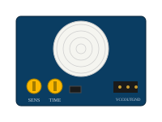<div style="font-weight:600;font-size:.85rem;margin-top:8px;color:#e2e8f0">PIR HC-SR501</div><div style="font-size:.72rem;color:#94a3b8">ruch · cyfrowy</div><div style="font-size:.84rem;color:#4ade80;font-weight:600;margin-top:5px">5–12 zł</div></div>
<div style="background:#1e293b;border:1px solid #334155;border-radius:10px;padding:12px;text-align:center">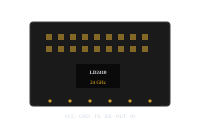<div style="font-weight:600;font-size:.85rem;margin-top:8px;color:#e2e8f0">LD2410 mmWave</div><div style="font-size:.72rem;color:#94a3b8">obecność · UART</div><div style="font-size:.84rem;color:#4ade80;font-weight:600;margin-top:5px">20–40 zł</div></div>
<div style="background:#1e293b;border:1px solid #334155;border-radius:10px;padding:12px;text-align:center">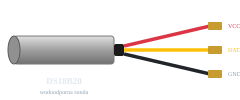<div style="font-weight:600;font-size:.85rem;margin-top:8px;color:#e2e8f0">DS18B20 (sonda)</div><div style="font-size:.72rem;color:#94a3b8">temperatura · 1-Wire</div><div style="font-size:.84rem;color:#4ade80;font-weight:600;margin-top:5px">12–25 zł</div></div>
<div style="background:#1e293b;border:1px solid #334155;border-radius:10px;padding:12px;text-align:center">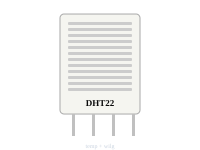<div style="font-weight:600;font-size:.85rem;margin-top:8px;color:#e2e8f0">DHT22 / AM2302</div><div style="font-size:.72rem;color:#94a3b8">temp + wilgotność</div><div style="font-size:.84rem;color:#4ade80;font-weight:600;margin-top:5px">12–30 zł</div></div>
<div style="background:#1e293b;border:1px solid #334155;border-radius:10px;padding:12px;text-align:center">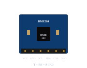<div style="font-weight:600;font-size:.85rem;margin-top:8px;color:#e2e8f0">BME280</div><div style="font-size:.72rem;color:#94a3b8">T + RH + ciśnienie · I²C</div><div style="font-size:.84rem;color:#4ade80;font-weight:600;margin-top:5px">15–35 zł</div></div>
<div style="background:#1e293b;border:1px solid #334155;border-radius:10px;padding:12px;text-align:center">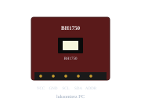<div style="font-weight:600;font-size:.85rem;margin-top:8px;color:#e2e8f0">BH1750</div><div style="font-size:.72rem;color:#94a3b8">luksomierz · I²C</div><div style="font-size:.84rem;color:#4ade80;font-weight:600;margin-top:5px">10–25 zł</div></div>
<div style="background:#1e293b;border:1px solid #334155;border-radius:10px;padding:12px;text-align:center">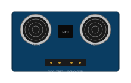<div style="font-weight:600;font-size:.85rem;margin-top:8px;color:#e2e8f0">HC-SR04</div><div style="font-size:.72rem;color:#94a3b8">odległość · ultradźwięk</div><div style="font-size:.84rem;color:#4ade80;font-weight:600;margin-top:5px">5–12 zł</div></div>
<div style="background:#1e293b;border:1px solid #334155;border-radius:10px;padding:12px;text-align:center">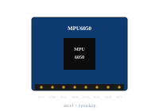<div style="font-weight:600;font-size:.85rem;margin-top:8px;color:#e2e8f0">MPU6050</div><div style="font-size:.72rem;color:#94a3b8">IMU 6-os · I²C</div><div style="font-size:.84rem;color:#4ade80;font-weight:600;margin-top:5px">10–25 zł</div></div>
<div style="background:#1e293b;border:1px solid #334155;border-radius:10px;padding:12px;text-align:center"><div style="font-weight:600;font-size:.85rem;margin-top:8px;color:#e2e8f0">Wilgotność gleby</div><div style="font-size:.72rem;color:#94a3b8">pojemnościowy · analog</div><div style="font-size:.84rem;color:#4ade80;font-weight:600;margin-top:5px">8–18 zł</div></div>
<div style="background:#1e293b;border:1px solid #334155;border-radius:10px;padding:12px;text-align:center">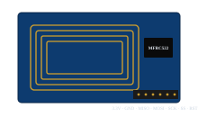<div style="font-weight:600;font-size:.85rem;margin-top:8px;color:#e2e8f0">RC522 RFID</div><div style="font-size:.72rem;color:#94a3b8">13,56 MHz · SPI</div><div style="font-size:.84rem;color:#4ade80;font-weight:600;margin-top:5px">8–20 zł</div></div>
<div style="background:#1e293b;border:1px solid #334155;border-radius:10px;padding:12px;text-align:center">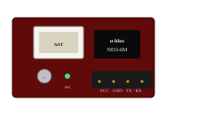<div style="font-weight:600;font-size:.85rem;margin-top:8px;color:#e2e8f0">GPS NEO-6M</div><div style="font-size:.72rem;color:#94a3b8">UART · z anteną</div><div style="font-size:.84rem;color:#4ade80;font-weight:600;margin-top:5px">25–80 zł</div></div>
<div style="background:#1e293b;border:1px solid #334155;border-radius:10px;padding:12px;text-align:center">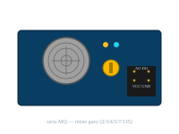<div style="font-weight:600;font-size:.85rem;margin-top:8px;color:#e2e8f0">MQ-2 (gaz)</div><div style="font-size:.72rem;color:#94a3b8">LPG / dym · analog</div><div style="font-size:.84rem;color:#4ade80;font-weight:600;margin-top:5px">5–15 zł</div></div>
<div style="background:#1e293b;border:1px solid #334155;border-radius:10px;padding:12px;text-align:center">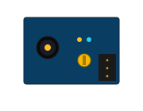<div style="font-weight:600;font-size:.85rem;margin-top:8px;color:#e2e8f0">Czujnik płomienia</div><div style="font-size:.72rem;color:#94a3b8">IR · cyfrowy/analog</div><div style="font-size:.84rem;color:#4ade80;font-weight:600;margin-top:5px">4–10 zł</div></div>
</div>

---

## Temperatura i wilgotność

### DS18B20 — cyfrowy termometr na magistrali 1-Wire
Najczęściej wybierany czujnik temperatury w domu/ogrodzie/CO. Dokładność ±0,5 °C, zakres -55…+125 °C, dostępny też w **wodoodpornej sondzie**. Wiele sztuk na jednym kablu (1-Wire). Pełny przykład w rozdziale 03.

**Podłączenie:** VCC=5V, GND=GND, DATA=D2, **pull-up 4,7 kΩ między DATA a VCC**.
**Biblioteki:** `OneWire`, `DallasTemperature`. **Cena:** 8–20 zł (moduł), 12–25 zł (sonda).

### DHT11 / DHT22 (AM2302) — temperatura + wilgotność
DHT11 jest tańszy i mniej dokładny (±2 °C, ±5 %RH), DHT22 lepszy (±0,5 °C, ±2 %RH). Wadą obu jest **wolne odczyty** (1 raz/2 s) i brak ciśnienia.

```cpp
#include <DHT.h>
#define DHTPIN 2
#define DHTTYPE DHT22       // lub DHT11
DHT dht(DHTPIN, DHTTYPE);

void setup() { Serial.begin(9600); dht.begin(); }
void loop() {
    float t = dht.readTemperature();
    float h = dht.readHumidity();
    Serial.print(t); Serial.print(" °C, ");
    Serial.print(h); Serial.println(" %RH");
    delay(2000);
}
```
**Pinout modułu (3-pin):** VCC, DATA, GND. **Biblioteka:** `DHT sensor library (Adafruit)`. **Cena:** DHT11 — 5–12 zł, DHT22 — 12–30 zł.

### BME280 — temperatura + wilgotność + ciśnienie (I²C lub SPI)
Dokładny i szybki, idealny do **stacji pogodowej** i pomiaru komfortu w domu.

```cpp
#include <Adafruit_BME280.h>
Adafruit_BME280 bme;
void setup() {
    Serial.begin(9600);
    bme.begin(0x76);          // adres 0x76 lub 0x77
}
void loop() {
    Serial.print(bme.readTemperature()); Serial.print(" °C, ");
    Serial.print(bme.readHumidity());     Serial.print(" %RH, ");
    Serial.print(bme.readPressure()/100); Serial.println(" hPa");
    delay(2000);
}
```
**Podłączenie I²C:** VCC=3,3V, GND, SDA=A4, SCL=A5. **Cena:** 15–35 zł.

### LM35 — analogowy termometr
Pojedynczy układ analogowy: 10 mV/°C, więc 25 °C → 0,25 V. Tani, prosty, ale wrażliwy na zakłócenia długich kabli.

```cpp
float t = analogRead(A0) * (5.0/1023.0) / 0.01;
```
**Cena:** 3–8 zł.

### MLX90614 — termometr na podczerwień (bezstykowy)
Mierzy temperaturę z odległości (od ludzi, butelek, powierzchni). Komunikacja I²C.
**Cena:** 30–70 zł.

### Termopary K + MAX6675 / MAX31855
Pomiar do **+1024 °C** (piekarnik, lutownica) przez SPI.
**Cena:** moduł z termoparą 25–55 zł.

---

## Odległość

### HC-SR04 — ultradźwiękowy
Mierzy odległość 2–400 cm dzięki echu fali dźwiękowej. Klasyk do parkowania, alarmów, poziomu wody.

```cpp
const int TRIG = 9, ECHO = 8;
void setup() {
    pinMode(TRIG, OUTPUT);
    pinMode(ECHO, INPUT);
    Serial.begin(9600);
}
void loop() {
    digitalWrite(TRIG, LOW);  delayMicroseconds(2);
    digitalWrite(TRIG, HIGH); delayMicroseconds(10);
    digitalWrite(TRIG, LOW);
    unsigned long czas = pulseIn(ECHO, HIGH, 30000);
    float cm = czas * 0.0343 / 2;   // prędkość dźwięku
    Serial.println(cm);
    delay(200);
}
```
**Podłączenie:** VCC=5V, TRIG, ECHO, GND. **Cena:** 5–12 zł.

### VL53L0X / VL53L1X — laserowy ToF
Precyzyjny pomiar (±3 %), zasięg 0–120 cm (L0X) lub 0–400 cm (L1X). Komunikacja I²C. Lepszy od ultradźwiękowego do precyzji i małych obiektów.
**Cena:** 25–60 zł.

### Sharp GP2Y0A21 — analogowy IR (10–80 cm)
Wąska wiązka podczerwieni, czyta `analogRead`. Stary, ale niezawodny.
**Cena:** 30–80 zł.

---

## Ruch i obecność

### PIR HC-SR501 — pasywna podczerwień
Wykrywa ciepło ciała w ruchu, regulowana czułość i czas „przytrzymania" stanu HIGH.
```cpp
const int PIR = 2;
void setup() { pinMode(PIR, INPUT); Serial.begin(9600); }
void loop() {
    if (digitalRead(PIR) == HIGH) Serial.println("Ruch!");
    delay(200);
}
```
**Podłączenie:** VCC=5V, OUT=D2, GND. **Cena:** 5–12 zł.

### RCWL-0516 — radarowy (mikrofalowy)
Wykrywa ruch przez **przez ścianki** plastikowe/drewniane. Tańszy od mmWave, ale „głupszy" (więcej fałszywych wyzwoleń).
**Cena:** 6–15 zł.

### LD2410 — radar 24 GHz mmWave
Wykrywa **obecność**, nie tylko ruch (nawet siedzącego człowieka). Dwa progi: „bliski" i „daleki", regulowane przez UART/aplikację. Idealny do biura i salonu.
**Cena:** 20–40 zł.

---

## IMU (przyspieszenie, żyroskop, kompas)

### MPU6050 — 6-osiowy (akcelerometr + żyroskop)
Klasyka do **dronów, balansujących robotów, wykrywania upadku**.
```cpp
#include <MPU6050.h>
MPU6050 mpu;
void setup() {
    Wire.begin(); mpu.initialize();
    Serial.begin(9600);
}
void loop() {
    int16_t ax, ay, az, gx, gy, gz;
    mpu.getMotion6(&ax, &ay, &az, &gx, &gy, &gz);
    Serial.print(ax); Serial.print('\t');
    Serial.print(ay); Serial.print('\t');
    Serial.println(az);
    delay(100);
}
```
**Cena:** 10–25 zł.

### MPU9250 / ICM-20948 — 9-osiowy (+ magnetometr)
Pełna orientacja (yaw/pitch/roll bez dryfu).
**Cena:** 40–90 zł.

### HMC5883L / QMC5883L — magnetometr (kompas)
Sam kompas 3-osiowy do kierunku północy.
**Cena:** 10–25 zł.

### ADXL345 — czuły akcelerometr
Wykrywanie wibracji, kroków, „tap".
**Cena:** 15–35 zł.

---

## Światło i kolor

### LDR (fotorezystor)
Rezystor zmieniający się ze światłem. Najtańszy „czujnik dnia/nocy".
**Podłączenie:** w dzielniku z 10 kΩ (rozdział 03). **Cena:** 1–3 zł.

### BH1750 — cyfrowy luksomierz I²C
Pomiar w **luksach** (1–65 535 lx), bez kalibracji.
```cpp
#include <BH1750.h>
BH1750 lux;
void setup() {
    Wire.begin(); lux.begin();
    Serial.begin(9600);
}
void loop() {
    Serial.print(lux.readLightLevel()); Serial.println(" lx");
    delay(500);
}
```
**Cena:** 10–25 zł.

### TSL2561 / TSL2591 — wysokoczuły luksomierz
Lepszy zakres dynamiki (od 0,1 lx do 80 000+ lx).
**Cena:** 25–50 zł.

### TCS34725 — czujnik koloru RGB+C
Mierzy składowe R, G, B i jasność. „Sortownik" kolorowych klocków.
**Cena:** 25–50 zł.

### Liniowy CCD TSL1401 / TCS3200
Tańszy, starszy czujnik koloru — wciąż popularny w prostych robotach „follow line".
**Cena:** 15–35 zł.

---

## Dźwięk

### KY-038 — moduł mikrofonu z komparatorem
Wyjście cyfrowe (próg) i analogowe. „Wykryj klaśnięcie" — tak, „rozumie mowę" — nie.
**Cena:** 4–10 zł.

### MAX9814 / MAX4466 — mikrofon z wzmacniaczem
Wyjście analogowe, do prostej analizy poziomu dźwięku, „vu-metru", reagowania na klaśnięcia.
**Cena:** 15–35 zł.

### INMP441 / ICS-43434 — mikrofony cyfrowe I²S
Wysoka jakość, ale **wymagają interfejsu I²S** — Uno tego nie ma, ESP32/Nano 33 BLE Sense mają.
**Cena:** 15–35 zł.

---

## Gaz, dym, jakość powietrza

### Seria MQ-x — gazy
Tanie heater + rezystor czuły na konkretny gaz. Każdy MQ to inny gaz:

| Model | Wykrywa |
|-------|---------|
| MQ-2 | LPG, dym, propan, metan |
| MQ-3 | alkohol (alkomat) |
| MQ-4 | metan (CH₄), gaz ziemny |
| MQ-5 | LPG, gaz ziemny |
| MQ-7 | tlenek węgla (CO) |
| MQ-9 | CO + palne |
| MQ-135 | NH₃, NOx, dym ogólnie (jakość powietrza) |

Wyjście **analogowe + cyfrowe (próg)**. Wymagają **wygrzewania 24–48 h** przed pierwszym kalibrowaniem. **Do ochrony życia używaj certyfikowanych czujek (rozdział 04 robotic).**
**Cena:** 5–15 zł.

### CCS811 — eCO₂ + tVOC (jakość powietrza)
Cyfrowy, I²C, mierzy CO₂ równoważne i lotne związki organiczne.
**Cena:** 30–60 zł.

### SGP30 / SGP40 — nowsze, dokładniejsze eCO₂ + tVOC
**Cena:** 40–90 zł.

### MH-Z19B — prawdziwy CO₂ (NDIR)
Dokładny pomiar CO₂ (komfort, wentylacja), pracuje po UART.
**Cena:** 80–180 zł.

---

## Ciśnienie i wysokość

### BMP180 / BMP280 — ciśnienie
Pochodne BME280 bez wilgotności; do wysokościomierza, kompensacji pogody.
**Cena:** 5–25 zł.

### MS5611 — precyzyjne ciśnienie (drony)
**Cena:** 25–50 zł.

---

## Wilgotność gleby i woda (ogród)

### Pojemnościowy czujnik wilgotności gleby (capacitive)
**Bezwzględnie ten typ, nie rezystancyjny** — nie koroduje, działa latami.
```cpp
int raw = analogRead(A0);
int suchość = map(raw, 240, 600, 0, 100);  // wartości kalibruj u siebie
```
**Cena:** 6–18 zł.

### YL-69 — rezystancyjny (NIE polecany)
Tani, ale elektrody korodują w ziemi w tygodnie. Wymień na pojemnościowy.

### Pływakowy czujnik poziomu wody
Prosty kontakt zwierany przez pływak — sygnał cyfrowy `LOW/HIGH`.
**Cena:** 4–12 zł.

### Czujnik deszczu (płytka z elektrodami)
Krople zwierają obwód → spadek napięcia na A0. Tani, ale ścieżki też korodują.
**Cena:** 4–10 zł.

### YF-S201 — przepływomierz wody
Łopatki obracają hall, generując impulsy proporcjonalne do przepływu (~7,5 imp = 1 L). Czytasz przez przerwanie (rozdział 03).
**Cena:** 25–50 zł.

### Czujnik zalania (water leakage)
Dwie elektrody na podłodze — gdy mokro, zwarcie. Do pralni, łazienki, kotłowni.
**Cena:** 5–15 zł.

---

## Prąd, napięcie, moc

### Dzielnik napięcia (DIY)
Schemat w rozdziale 03. Pomiar napięcia baterii 12 V z rezystorów 10 k + 4,7 k.

### ACS712 — pomiar prądu (hallotron)
Wersje 5 A, 20 A, 30 A. Wyjście analogowe.
```cpp
float v = analogRead(A0) * (5.0/1023.0);
float prąd = (v - 2.5) / 0.066;   // dla wersji 30A (0,066 V/A)
```
**Cena:** 10–25 zł.

### INA219 / INA226 — precyzyjny prąd + napięcie (I²C)
Lepsze niż ACS712: cyfrowy, mała rezystancja boczna, automatyczne moc/energia. Świetne do mierzenia poboru baterii.
**Cena:** 12–30 zł.

### PZEM-004T — pełny pomiar 230 V (V, I, P, energia, cosφ)
Moduł do *bezpiecznego* pomiaru sieciowego z izolacją — komunikacja UART. **Idealny do monitoringu zużycia prądu w mieszkaniu.**
**Cena:** 80–160 zł.

---

## Kontaktrony, otwarcia, wibracje

### Kontaktron (reed switch)
Magnetyczny przełącznik — magnes obok = zwarte. Do drzwi, okien, bram.
**Cena:** 2–6 zł (sam), 6–15 zł (moduł z LED).

### KY-002 / SW-420 — czujnik wibracji
Kulka w sprężynie, wykrywa puknięcie/wstrząs.
**Cena:** 3–8 zł.

### Czujnik nachylenia (tilt SW-200)
Kulka zwiera kontakt, gdy obudowa się przechyli.
**Cena:** 3–8 zł.

### Czujnik dotykowy pojemnościowy TTP223
Zamiast przycisku — czuła „płytka". Reaguje na palec przez papier, plastik.
**Cena:** 3–8 zł.

---

## Identyfikacja: RFID i NFC

### RC522 — czytnik RFID 13,56 MHz (Mifare)
Najpopularniejszy. Czyta i zapisuje karty/breloki Mifare. Wystarczy do **kontroli dostępu DIY**.
**Podłączenie SPI:** SDA(SS)=D10, SCK=D13, MOSI=D11, MISO=D12, IRQ (opcjonalny), GND, RST=D9, **3,3 V** (uwaga!).
```cpp
#include <SPI.h>
#include <MFRC522.h>
MFRC522 rfid(10, 9);
void setup() { Serial.begin(9600); SPI.begin(); rfid.PCD_Init(); }
void loop() {
    if (!rfid.PICC_IsNewCardPresent() || !rfid.PICC_ReadCardSerial()) return;
    for (byte i = 0; i < rfid.uid.size; i++) {
        Serial.print(rfid.uid.uidByte[i], HEX); Serial.print(" ");
    }
    Serial.println();
    rfid.PICC_HaltA();
}
```
**Biblioteka:** `MFRC522`. **Cena:** 8–20 zł.

### PN532 — NFC (13,56 MHz, lepszy)
Czyta też nowoczesne karty NFC (telefony, MasterCard PayPass — UID).
**Cena:** 35–80 zł.

### Czytnik 125 kHz (EM4100)
Stare „breloki na klatkę" — RDM6300.
**Cena:** 10–25 zł.

---

## Pozycja i GPS

### NEO-6M / NEO-8M — GPS UART
Klasyczne moduły GPS z anteną. Strumień NMEA przez UART.
```cpp
#include <TinyGPSPlus.h>
#include <SoftwareSerial.h>
TinyGPSPlus gps; SoftwareSerial ss(4, 3);
void setup() { Serial.begin(9600); ss.begin(9600); }
void loop() {
    while (ss.available()) gps.encode(ss.read());
    if (gps.location.isUpdated()) {
        Serial.print(gps.location.lat(), 6); Serial.print(", ");
        Serial.println(gps.location.lng(), 6);
    }
}
```
**Cena:** 25–80 zł (z anteną).

---

## Hala efekt, kąty obrotu

### A3144 — czujnik hallotronowy (cyfrowy)
Wykrywa magnes — do zliczania obrotów, czujników przepływu, „bezstykowych przycisków".
**Cena:** 1–4 zł.

### Enkoder obrotowy KY-040
„Pokrętło" z impulsami A/B + przyciskiem — do menu na LCD, regulacji parametrów.
**Cena:** 4–12 zł.

### Potencjometr 10 kΩ
Najprostsze wejście analogowe — wkręcasz, kalibrujesz.
**Cena:** 1–5 zł.

---

## Specjalne / nietypowe

### KY-039 — czujnik tętna (palec na LED + fotodioda)
Hobbystyczny pulsoksymetr.
**Cena:** 5–15 zł.

### MAX30102 — tętno + saturacja
Cyfrowy, I²C, dokładniejszy.
**Cena:** 15–40 zł.

### Czujnik płomienia (KY-026)
Fotodioda w zakresie podczerwieni — wykrywa płomień z 1 m.
**Cena:** 4–10 zł.

### Gestowy APDS-9960
Rozpoznaje gesty (w lewo/prawo/góra/dół), kolor i światło.
**Cena:** 25–50 zł.

### Czujnik deszczu MH-RD (zestaw z modułem)
Płytka z elektrodami + moduł komparatora.
**Cena:** 4–10 zł.

### Czujnik UV (ML8511 / GUVA-S12SD)
Pomiar promieniowania UV — do stacji pogodowej.
**Cena:** 20–50 zł.

---

## Szybka ściąga „co kupić dla projektu"

| Projekt | Czujniki |
|---------|----------|
| Domowa stacja pogodowa | BME280 + BH1750 + UV (+ GPS opc.) |
| Sterowanie światłem | PIR (HC-SR501) + LDR/BH1750 |
| Automatyczne nawadnianie | wilgotność gleby (pojemn.) + DS18B20 + pływak |
| Alarm | PIR + kontaktron + LD2410 + buzzer (rozdział 05) |
| Monitoring jakości powietrza | BME280 + MH-Z19B (CO₂) + SGP40 (VOC) |
| Pomiar zużycia prądu | PZEM-004T (230 V) lub INA219 (DC) |
| Kontrola dostępu | RC522 + przekaźnik elektrozamka |
| Robot mobilny | HC-SR04 + MPU6050 + enkoder + IR follow line |

---

➡️ Dalej: **[05 — Aktuatory i wyświetlacze](05-aktuatory.html)** — silniki, serwa, przekaźniki, taśmy LED, LCD, OLED, TFT.
