# Aktuatory i wyświetlacze

„Mięśnie" Arduino: silniki, serwa, przekaźniki, elektrozawory, taśmy LED i wyświetlacze. W tym rozdziale każdy moduł z **podłączeniem + kodem**. Pamiętaj zasady z rozdziału 1: pin Arduino daje max ~20 mA — wszystko mocniejsze wymaga osobnego zasilania i tranzystora/przekaźnika.

## Galeria aktuatorów i wyświetlaczy z cenami

<div style="display:grid;grid-template-columns:repeat(auto-fill,minmax(170px,1fr));gap:12px;margin:18px 0">
<div style="background:#1e293b;border:1px solid #334155;border-radius:10px;padding:12px;text-align:center">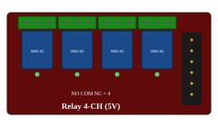<div style="font-weight:600;font-size:.85rem;margin-top:8px;color:#e2e8f0">Relay 4-CH</div><div style="font-size:.72rem;color:#94a3b8">przekaźnik · 230 V/10 A</div><div style="font-size:.84rem;color:#4ade80;font-weight:600;margin-top:5px">15–35 zł</div></div>
<div style="background:#1e293b;border:1px solid #334155;border-radius:10px;padding:12px;text-align:center">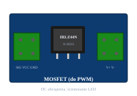<div style="font-weight:600;font-size:.85rem;margin-top:8px;color:#e2e8f0">MOSFET (IRLZ44N)</div><div style="font-size:.72rem;color:#94a3b8">PWM · DC, LED, pompy</div><div style="font-size:.84rem;color:#4ade80;font-weight:600;margin-top:5px">5–15 zł</div></div>
<div style="background:#1e293b;border:1px solid #334155;border-radius:10px;padding:12px;text-align:center">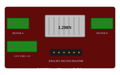<div style="font-weight:600;font-size:.85rem;margin-top:8px;color:#e2e8f0">L298N</div><div style="font-size:.72rem;color:#94a3b8">H-mostek · 2A · 2 silniki DC</div><div style="font-size:.84rem;color:#4ade80;font-weight:600;margin-top:5px">8–20 zł</div></div>
<div style="background:#1e293b;border:1px solid #334155;border-radius:10px;padding:12px;text-align:center">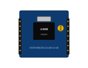<div style="font-weight:600;font-size:.85rem;margin-top:8px;color:#e2e8f0">A4988</div><div style="font-size:.72rem;color:#94a3b8">krokowiec NEMA17 · CNC</div><div style="font-size:.84rem;color:#4ade80;font-weight:600;margin-top:5px">4–12 zł</div></div>
<div style="background:#1e293b;border:1px solid #334155;border-radius:10px;padding:12px;text-align:center">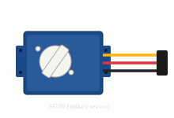<div style="font-weight:600;font-size:.85rem;margin-top:8px;color:#e2e8f0">Servo SG90</div><div style="font-size:.72rem;color:#94a3b8">mikro · 0–180° · PWM</div><div style="font-size:.84rem;color:#4ade80;font-weight:600;margin-top:5px">8–18 zł</div></div>
<div style="background:#1e293b;border:1px solid #334155;border-radius:10px;padding:12px;text-align:center">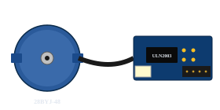<div style="font-weight:600;font-size:.85rem;margin-top:8px;color:#e2e8f0">28BYJ-48 + ULN2003</div><div style="font-size:.72rem;color:#94a3b8">krokowiec · zestaw 5V</div><div style="font-size:.84rem;color:#4ade80;font-weight:600;margin-top:5px">5–15 zł</div></div>
<div style="background:#1e293b;border:1px solid #334155;border-radius:10px;padding:12px;text-align:center">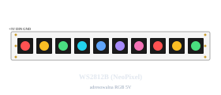<div style="font-weight:600;font-size:.85rem;margin-top:8px;color:#e2e8f0">WS2812B (1 m)</div><div style="font-size:.72rem;color:#94a3b8">adresowalna RGB · 5V</div><div style="font-size:.84rem;color:#4ade80;font-weight:600;margin-top:5px">20–50 zł</div></div>
<div style="background:#1e293b;border:1px solid #334155;border-radius:10px;padding:12px;text-align:center">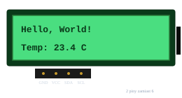<div style="font-weight:600;font-size:.85rem;margin-top:8px;color:#e2e8f0">LCD 16×2 + I²C</div><div style="font-size:.72rem;color:#94a3b8">znakowy · 2 piny SDA/SCL</div><div style="font-size:.84rem;color:#4ade80;font-weight:600;margin-top:5px">10–25 zł</div></div>
<div style="background:#1e293b;border:1px solid #334155;border-radius:10px;padding:12px;text-align:center">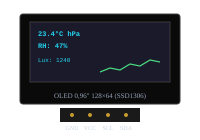<div style="font-weight:600;font-size:.85rem;margin-top:8px;color:#e2e8f0">OLED 0,96"</div><div style="font-size:.72rem;color:#94a3b8">128×64 · I²C · SSD1306</div><div style="font-size:.84rem;color:#4ade80;font-weight:600;margin-top:5px">10–25 zł</div></div>
<div style="background:#1e293b;border:1px solid #334155;border-radius:10px;padding:12px;text-align:center">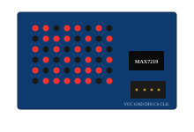<div style="font-weight:600;font-size:.85rem;margin-top:8px;color:#e2e8f0">MAX7219 8×8</div><div style="font-size:.72rem;color:#94a3b8">matryca LED · SPI</div><div style="font-size:.84rem;color:#4ade80;font-weight:600;margin-top:5px">8–18 zł</div></div>
<div style="background:#1e293b;border:1px solid #334155;border-radius:10px;padding:12px;text-align:center">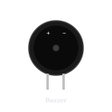<div style="font-weight:600;font-size:.85rem;margin-top:8px;color:#e2e8f0">Buzzer</div><div style="font-size:.72rem;color:#94a3b8">aktywny / pasywny</div><div style="font-size:.84rem;color:#4ade80;font-weight:600;margin-top:5px">2–6 zł</div></div>
</div>

---

## Przełączanie obciążeń

### Moduł przekaźnikowy 1/2/4/8-kanałowy
Najprostszy sposób, by sterownik włączył lampę, pompę 230 V albo silnik 12 V. Wybieraj wersję **z optoizolacją** — dioda transoptora oddziela mikrokontroler od strony obciążenia.

```cpp
const int RELAY = 7;
void setup() { pinMode(RELAY, OUTPUT); digitalWrite(RELAY, HIGH); }   // HIGH = OFF dla aktywnego niskim
void loop() {
    digitalWrite(RELAY, LOW);  delay(5000);   // załączamy obciążenie na 5 s
    digitalWrite(RELAY, HIGH); delay(5000);   // wyłączamy
}
```

> **Uwaga:** większość chińskich modułów jest **active-LOW** — `LOW` = przekaźnik włączony. Spójrz na opis modułu (zwykle nadrukowane „Trig LOW"). Po starcie `LOW` może chwilowo „klikać" — w `setup()` ustaw najpierw `HIGH`, potem `OUTPUT`.

**Podłączenie:** VCC=5V, GND, IN1..INn=piny D2..Dn. Po stronie obciążenia: NO/COM (normalnie otwarty) wpina się w obwód jak zwykły wyłącznik. **Cena:** 1-kan. 6–15 zł, 4-kan. 15–35 zł, 8-kan. 25–60 zł.

### Przekaźnik półprzewodnikowy SSR-25DA, SSR-40DA
Bezgłośny, do bardzo częstego przełączania (ściemnianie grzałki, regulacja PWM). Wymaga radiatora powyżej 5 A. Sygnał sterowania 3–32 V DC.
**Cena:** 20–60 zł (zależnie od prądu).

### Tranzystor MOSFET (moduł IRLZ44N, IRF520)
Do **płynnego** sterowania obciążeniami DC (taśma LED, pompka 12 V, mały silnik) sygnałem PWM. Cichy, bez zużywających się styków.
```cpp
const int FAN = 9;          // pin PWM
void setup() { pinMode(FAN, OUTPUT); }
void loop() {
    analogWrite(FAN, 0);   delay(2000);   // 0%
    analogWrite(FAN, 128); delay(2000);   // 50%
    analogWrite(FAN, 255); delay(2000);   // 100%
}
```
**Podłączenie modułu MOSFET:** VCC = napięcie obciążenia, GND wspólny z Arduino, SIG = pin PWM, V+/V- = wyjście do urządzenia. **Pamiętaj o diodzie gaszącej**, jeśli obciążenie ma cewkę. **Cena:** 5–15 zł.

---

## Silniki DC i ich sterowniki

### L293D — najprostszy H-mostek
Steruje **dwoma silnikami DC** w obu kierunkach, do ~600 mA na kanał. Zbyt słaby do większych silników, ale tani i edukacyjny.
**Cena:** 5–15 zł.

### L298N — popularny moduł H-mostek
Standard. Dwa silniki DC do **2 A**, kierunek + PWM, możliwe zasilanie 5–35 V.
```cpp
const int IN1=8, IN2=9, ENA=10;    // ENA musi być PWM!
void setup() {
    pinMode(IN1, OUTPUT); pinMode(IN2, OUTPUT);
    pinMode(ENA, OUTPUT);
}
void naprzód(int prędkość) {
    digitalWrite(IN1, HIGH); digitalWrite(IN2, LOW);
    analogWrite(ENA, prędkość);
}
void wstecz(int prędkość) {
    digitalWrite(IN1, LOW); digitalWrite(IN2, HIGH);
    analogWrite(ENA, prędkość);
}
void stop() { analogWrite(ENA, 0); }

void loop() {
    naprzód(180); delay(2000);
    stop();       delay(500);
    wstecz(180);  delay(2000);
    stop();       delay(500);
}
```
**Wady L298N:** stary, gubi ~2 V na tranzystorach (mały silnik 6 V z zasilania 7 V dostanie 5 V). **Cena:** 8–20 zł.

### BTS7960 — mocny H-mostek (43 A!)
Do silników 24 V/kilkadziesiąt A — robotyka „mocna", autonomiczne wózki.
**Cena:** 35–80 zł.

### DRV8871 — nowoczesny, kompaktowy mostek (3,6 A)
Mała zwarcie- i prądochronna płytka — częsta alternatywa dla L298N.
**Cena:** 10–25 zł.

### TB6612FNG — efektywny mostek 2× 1,2 A
Lepszy od L293D, niska strata mocy, idealny do robotów na bateriach.
**Cena:** 10–25 zł.

---

## Silniki krokowe

### 28BYJ-48 + ULN2003 — najtańszy „stepper"
Mały silnik unipolarny z gotowym modułem sterownika ULN2003. Powolny i słaby, ale **świetny do nauki** i drobnych projektów (mechanizmy podajników, zegary).
```cpp
#include <Stepper.h>
const int STEPS_PER_REV = 2048;
Stepper stepper(STEPS_PER_REV, 8, 10, 9, 11);   // kolejność IN1/IN3/IN2/IN4!

void setup() { stepper.setSpeed(10); }   // 10 obr/min
void loop() {
    stepper.step(STEPS_PER_REV);    // pełen obrót
    delay(1000);
    stepper.step(-STEPS_PER_REV);
    delay(1000);
}
```
**Cena:** 5–15 zł (komplet).

### A4988 / DRV8825 — sterowniki krokowe NEMA17 (drukarki 3D, CNC)
Mocniejsze silniki bipolarne, mikrokroki. Standard dla projektów ruchomych (slider, CNC, druk 3D).
**Podłączenie:** STEP=pin PWM (każdy impuls = 1 krok), DIR=kierunek, ENABLE=aktywacja. **Wymagają zewnętrznego zasilania 8–35 V**.
```cpp
const int STEP=3, DIR=4, EN=5;
void setup() {
    pinMode(STEP, OUTPUT); pinMode(DIR, OUTPUT); pinMode(EN, OUTPUT);
    digitalWrite(EN, LOW);  // aktywny
}
void krok(int liczbaImpulsów, int kierunek) {
    digitalWrite(DIR, kierunek);
    for (int i = 0; i < liczbaImpulsów; i++) {
        digitalWrite(STEP, HIGH); delayMicroseconds(500);
        digitalWrite(STEP, LOW);  delayMicroseconds(500);
    }
}
void loop() {
    krok(200, HIGH); delay(500);    // 1 obrót w jedną stronę (NEMA17 = 200 kroków)
    krok(200, LOW);  delay(500);
}
```
**Cena:** A4988 — 4–12 zł, DRV8825 — 6–15 zł.

### TMC2208 / TMC2209 — ciche sterowniki (jak w drukarce 3D)
Praktycznie bezgłośne, lepsza mikrokrokowość. Premium w projekcie domowym.
**Cena:** 15–35 zł.

---

## Serwomechanizmy

### SG90, MG90 (mikro, plastikowe)
Najtańszy serwomechanizm 9 g, ruch 0–180°, prąd ~250 mA przy ruchu. Do klap, małych zaworów, otwarcia karmnika.
```cpp
#include <Servo.h>
Servo s;
void setup() { s.attach(9); }     // sygnał PWM
void loop() {
    for (int k = 0; k <= 180; k++) { s.write(k); delay(10); }
    for (int k = 180; k >= 0; k--) { s.write(k); delay(10); }
}
```
**Podłączenie:** żółty/pomarańczowy = sygnał (pin PWM Arduino), czerwony = 5 V (najlepiej z osobnego zasilacza!), brązowy/czarny = GND wspólny. **Cena:** 8–18 zł.

### MG996R (metal, większe)
Większy moment (~10 kg·cm), prąd 600 mA – **nie zasilaj z USB Arduino**, bo zaboli.
**Cena:** 20–50 zł.

### Serwo „continuous rotation" (np. FS5103R)
Modyfikacja, w której `write(0/90/180)` to nie pozycja, lecz kierunek i prędkość. Do prostych napędów kół.
**Cena:** 25–60 zł.

---

## Elektrozawory, pompy, elektromagnesy

### Elektrozawór 12 V DC (do nawadniania)
Cewka ~150–300 mA — sterujesz przekaźnikiem lub MOSFET-em. **Dioda gasząca równolegle do cewki obowiązkowo** (np. 1N4007).
**Cena:** 25–60 zł.

### Pompa membranowa 12 V (385/R385)
Pompka „akwariowa", ~1,5 L/min. Do beczki, nawadniania kropelkowego.
```cpp
// Sterowana MOSFET-em z PWM dla regulacji wydajności:
analogWrite(PUMP_PIN, 200);   // ~78% mocy
```
**Cena:** 30–70 zł.

### Elektromagnes / elektrozamek
Otwiera drzwi/szafkę. Steruj przekaźnikiem lub MOSFET-em + dioda gasząca.
**Cena:** 25–80 zł.

---

## LED-y i taśmy

### Pojedynczy LED (jednokolorowy)
Rezystor + pin (rozdział 03). Szybki sukces dla początkującego.

### LED RGB (wspólna anoda lub katoda)
4 nóżki: R, G, B + wspólna. Trzy rezystory, trzy piny PWM:
```cpp
const int R=9, G=10, B=11;
void setKolor(int r, int g, int b) {
    analogWrite(R, r); analogWrite(G, g); analogWrite(B, b);
}
void setup() { pinMode(R, OUTPUT); pinMode(G, OUTPUT); pinMode(B, OUTPUT); }
void loop() {
    setKolor(255, 0, 0);   delay(500);   // czerwony
    setKolor(0, 255, 0);   delay(500);   // zielony
    setKolor(0, 0, 255);   delay(500);   // niebieski
    setKolor(255, 255, 0); delay(500);   // żółty
}
```

### Taśma LED 12 V (RGB, jednokolorowa)
Sterowana 1× MOSFET (jednokolorowa) lub 3× MOSFET (RGB) + osobny zasilacz 12 V. PWM dla ściemniania.

### WS2812B / SK6812 NeoPixel — adresowalne
Każda dioda osobno (kolor + jasność), jeden pin danych z Arduino. **Wymaga zasilania 5 V z zapasem prądu (1 dioda ~ 60 mA przy pełnej bieli!)** — dla 60 diod licz 3,6 A.
```cpp
#include <FastLED.h>
#define NUM_LEDS  30
#define DATA_PIN  6
CRGB leds[NUM_LEDS];
void setup() {
    FastLED.addLeds<NEOPIXEL, DATA_PIN>(leds, NUM_LEDS);
    FastLED.setBrightness(64);   // 0–255 — nie pal max bez chłodzenia
}
void loop() {
    for (int i = 0; i < NUM_LEDS; i++) {
        leds[i] = CHSV((i * 8 + millis()/20) % 256, 255, 255);
    }
    FastLED.show();
    delay(30);
}
```
**Bezpieczeństwo:** kondensator **1000 µF** na linii zasilania blisko taśmy + **rezystor ~470 Ω** szeregowo z linią danych. **Cena:** taśma WS2812B 1 m (30 LED) 20–50 zł.

### APA102 / SK9822 — adresowalne SPI (płynniejsze)
Wymagają 2 pinów (CLK + DATA), za to bardzo szybkie i bez „migotania" przy efektach.
**Cena:** podobnie do WS2812B + nieco drożej.

---

## Wyświetlacze tekstowe

### LCD 16×2 / 20×4 — równoległy
Klasyczny dwurzędowy znakowy LCD. **6 pinów** Arduino + zasilanie + potencjometr kontrastu. Dużo kabli.
**Biblioteka:** `LiquidCrystal`.

### LCD 16×2 / 20×4 z „I²C backpack" (PCF8574)
**Polecamy** — ten sam LCD z modułem I²C: zostają 2 piny SDA/SCL.
```cpp
#include <LiquidCrystal_I2C.h>
LiquidCrystal_I2C lcd(0x27, 16, 2);   // adres 0x27 lub 0x3F
void setup() {
    lcd.init(); lcd.backlight();
    lcd.print("Witaj Arduino!");
    lcd.setCursor(0, 1);
    lcd.print("Temp: ");
}
void loop() {
    lcd.setCursor(6, 1);
    lcd.print(millis()/1000); lcd.print("s ");
    delay(500);
}
```
**Cena:** 10–25 zł (16×2 + I²C).

---

## Wyświetlacze graficzne

### OLED 0,96" 128×64 SSD1306 (I²C, biały/niebieski)
Najpopularniejszy mały „dashboard" — wysoki kontrast, niski pobór, I²C.
```cpp
#include <Adafruit_SSD1306.h>
#include <Wire.h>
Adafruit_SSD1306 oled(128, 64, &Wire, -1);
void setup() {
    oled.begin(SSD1306_SWITCHCAPVCC, 0x3C);
    oled.clearDisplay();
    oled.setTextSize(2);
    oled.setTextColor(WHITE);
    oled.setCursor(0, 0);
    oled.println("Arduino");
    oled.display();
}
void loop() {}
```
**Cena:** 10–25 zł.

### OLED 1,3" SH1106
Większy ekran (128×64), wymaga osobnego sterownika `Adafruit_SH1106` lub `U8g2`.
**Cena:** 15–35 zł.

### OLED kolorowy 0,96" SSD1331 / SH1107
Pełne RGB, ale mała przekątna; raczej do gadżetów.
**Cena:** 25–60 zł.

### TFT 2,2" / 2,4" / 2,8" / 3,5" ILI9341 (SPI)
Pełnokolorowy ekran graficzny, często z czytnikiem SD i (czasem) z dotykiem. Świetny do **kompletnego interfejsu projektu**. Wymaga 4–7 pinów SPI.
```cpp
#include <Adafruit_GFX.h>
#include <Adafruit_ILI9341.h>
Adafruit_ILI9341 tft(10, 9, 8);   // CS, DC, RST
void setup() {
    tft.begin();
    tft.fillScreen(ILI9341_BLACK);
    tft.setCursor(0, 0); tft.setTextColor(ILI9341_YELLOW); tft.setTextSize(3);
    tft.println("Witaj!");
}
void loop() {}
```
**Cena:** 25–80 zł (zależnie od przekątnej).

### e-Paper (Waveshare 2,9" / 4,2")
„Papierowy" wyświetlacz — utrzymuje obraz bez prądu, idealny do dashboardów bateryjnych.
**Cena:** 70–200 zł.

### Pełnokolorowy TFT 1,3" / 1,44" ST7735 / ST7789
Mały, szybki, SPI. Dobre do menu i wykresów.
**Cena:** 15–40 zł.

---

## Wyświetlacze segmentowe i matryce

### 7-segmentowy LED (1–4 cyfry)
„Stary" wyświetlacz cyfrowy. Bezpośrednio multipleksowany lub przez moduł **TM1637** (4 cyfry I²C-podobne):
```cpp
#include <TM1637Display.h>
TM1637Display d(2, 3);   // CLK, DIO
void setup() { d.setBrightness(7); }
void loop() {
    d.showNumberDec(millis()/1000);
    delay(500);
}
```
**Cena:** 6–18 zł.

### Matryca LED 8×8 / 8×32 z MAX7219
Wyświetlanie animacji, prostych ikon, biegnącego tekstu.
**Biblioteka:** `LedControl` lub `MD_Parola`. **Cena:** 8×8 — 8–18 zł, 4× 8×8 — 25–55 zł.

### NeoMatrix (WS2812)
Macierz pełnokolorowych adresowalnych LED-ów — efektowna, ale prądożerna.
**Cena:** 8×8 — 30–80 zł.

---

## Dźwięk

### Buzzer pasywny i aktywny
**Aktywny** ma własny generator — `digitalWrite(HIGH)` = pikanie.
**Pasywny** wymaga PWM/tonu:
```cpp
const int BUZZ = 8;
void setup() {}
void loop() {
    tone(BUZZ, 1000);  delay(200);   // 1 kHz przez 200 ms
    tone(BUZZ, 1500);  delay(200);
    noTone(BUZZ);      delay(500);
}
```
**Cena:** 2–6 zł.

### DFPlayer Mini — odtwarzacz MP3 z karty SD
Komunikacja UART, do alarmów, „mów co czujnik wykrył", komunikatów głosowych.
**Cena:** 12–30 zł.

### Wzmacniacz PAM8403 + głośnik
Stereo 2× 3 W, kostka 3 zł. Daje przyzwoite głośnik z prostego DFPlayera.
**Cena:** 5–15 zł (moduł).

---

## Krótka ściąga: aktuator do projektu

| Cel | Aktuator |
|-----|----------|
| Załącz lampę 230 V | przekaźnik z optoizolacją lub SSR |
| Ściemniaj LED 12 V | MOSFET + PWM |
| Otwórz/zamknij wodę | elektrozawór 12 V + przekaźnik/MOSFET + dioda |
| Obrót na 90° (klapa) | serwo SG90/MG996R |
| Silnik wózka | L298N (mały) lub BTS7960 (duży) |
| Precyzyjny obrót | krokowiec NEMA17 + A4988/DRV8825 |
| Komunikat głosowy | DFPlayer Mini + głośnik |
| Mały panel info | OLED 0,96" SSD1306 |
| Pełny dashboard | TFT 2,8" ILI9341 + dotyk |
| Efekt świetlny | taśma WS2812B + FastLED |

---

➡️ Dalej: **[06 — Shieldy i nakładki](06-shieldy.html)** — gotowe „naszywki" rozszerzające Arduino o sieć, silniki, SD i więcej.
