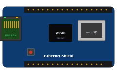
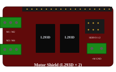
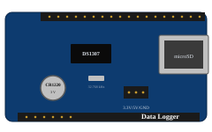
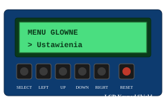
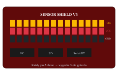
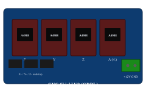

# Shieldy i nakładki

**Shield** to płytka PCB, która **wpina się prosto w listwy Arduino** — bez kabli, bez lutowania, bez błędów połączeń. Wszystkie sygnały i zasilanie biegną z listew Uno/Mega na shield, a ten dodaje konkretną funkcjonalność. Można je **stackować** (nakładać po kilka na siebie), o ile nie biją się o te same piny.

## Galeria shieldów z cenami

<div style="display:grid;grid-template-columns:repeat(auto-fill,minmax(180px,1fr));gap:14px;margin:18px 0">
<div style="background:#1e293b;border:1px solid #334155;border-radius:10px;padding:12px;text-align:center"><div style="font-weight:600;font-size:.85rem;margin-top:8px;color:#e2e8f0">Ethernet Shield</div><div style="font-size:.72rem;color:#94a3b8">W5500 LAN + slot SD</div><div style="font-size:.84rem;color:#4ade80;font-weight:600;margin-top:5px">45–90 zł</div></div>
<div style="background:#1e293b;border:1px solid #334155;border-radius:10px;padding:12px;text-align:center"><div style="font-weight:600;font-size:.85rem;margin-top:8px;color:#e2e8f0">Motor Shield</div><div style="font-size:.72rem;color:#94a3b8">L293D × 2 · 4 DC / 2 stepper</div><div style="font-size:.84rem;color:#4ade80;font-weight:600;margin-top:5px">25–60 zł</div></div>
<div style="background:#1e293b;border:1px solid #334155;border-radius:10px;padding:12px;text-align:center"><div style="font-weight:600;font-size:.85rem;margin-top:8px;color:#e2e8f0">Data Logger</div><div style="font-size:.72rem;color:#94a3b8">SD + RTC DS1307</div><div style="font-size:.84rem;color:#4ade80;font-weight:600;margin-top:5px">25–55 zł</div></div>
<div style="background:#1e293b;border:1px solid #334155;border-radius:10px;padding:12px;text-align:center"><div style="font-weight:600;font-size:.85rem;margin-top:8px;color:#e2e8f0">LCD Keypad</div><div style="font-size:.72rem;color:#94a3b8">LCD 16×2 + 6 przycisków</div><div style="font-size:.84rem;color:#4ade80;font-weight:600;margin-top:5px">15–35 zł</div></div>
<div style="background:#1e293b;border:1px solid #334155;border-radius:10px;padding:12px;text-align:center"><div style="font-weight:600;font-size:.85rem;margin-top:8px;color:#e2e8f0">Sensor Shield V5</div><div style="font-size:.72rem;color:#94a3b8">każdy pin → 3-pin JST</div><div style="font-size:.84rem;color:#4ade80;font-weight:600;margin-top:5px">15–35 zł</div></div>
<div style="background:#1e293b;border:1px solid #334155;border-radius:10px;padding:12px;text-align:center"><div style="font-weight:600;font-size:.85rem;margin-top:8px;color:#e2e8f0">CNC Shield V3</div><div style="font-size:.72rem;color:#94a3b8">4× A4988 · GRBL · drukarki 3D</div><div style="font-size:.84rem;color:#4ade80;font-weight:600;margin-top:5px">20–50 zł</div></div>
</div>

## Standard pinów

Shield wymyślony pod **Arduino Uno R3** (lub R4) działa pinowo również na:
- **Arduino Mega 2560** — listwy Uno R3 są podzbiorem Megi,
- **Leonardo / Micro** w wersji shieldowej (Leonardo ma układ jak Uno),
- **klonach R3 firm trzecich** (Funduino, Elegoo).

> Nie działa na **Nano / Pro Mini** (inna obudowa) ani na **MKR / Nano 33** (inny rozmiar listew). Dla tych płytek są osobne, mniejsze shieldy (MKR shieldy).

Kluczowy aspekt to **konflikt pinów**: jeśli dwa shieldy zajmują ten sam pin, jeden z nich nie zadziała. Najczęściej walka idzie o piny **SPI (D10–D13)**, **I²C (A4/A5)** i wybrane PWM.

---

## Ethernet Shield (W5100, W5500)

Daje Arduino **przewodowy LAN (RJ45)** — serwer/klient HTTP, MQTT, ModbusTCP, REST API. Wbudowany **slot kart microSD** (na linii SPI).

**Piny:** SPI (D10 jako CS Ethernet, **D4 jako CS karty SD**), D13/D12/D11 magistrala SPI.
**Biblioteki:** `Ethernet.h` (W5100), `Ethernet2.h` / `EthernetLarge.h` (W5500), `SD.h` (karta).

```cpp
#include <SPI.h>
#include <Ethernet.h>
byte mac[] = { 0xDE, 0xAD, 0xBE, 0xEF, 0xFE, 0xED };
EthernetServer server(80);

void setup() {
    Serial.begin(9600);
    Ethernet.begin(mac);
    server.begin();
    Serial.print("Serwer pod: "); Serial.println(Ethernet.localIP());
}
void loop() {
    EthernetClient client = server.available();
    if (client) {
        client.println("HTTP/1.1 200 OK");
        client.println("Content-Type: text/html\n");
        client.println("<h1>Hello z Arduino!</h1>");
        delay(1);
        client.stop();
    }
}
```

**Cena:** W5100 — 35–70 zł, W5500 (szybszy, mniej RAM-żerny) — 45–90 zł.

---

## WiFi Shield / ESP8266 Shield

Oryginalny Arduino WiFi Shield jest drogi i przestarzały — w praktyce ludzie używają:
- **Shieldów z ESP8266** komunikujących się z Uno przez UART (komendy AT) — działa, ale wolno i niewygodnie,
- **WeMos D1 / D1 R1** — to nie shield, lecz **Arduino R3 z wbudowanym ESP8266**, w pełni programowane jak Arduino z WiFi.

> Realnie: jeśli potrzebujesz WiFi z Arduino, kup **Uno R4 WiFi** albo **Nano 33 IoT / MKR WiFi 1010**. To prościej i taniej niż shield.

---

## Motor Shield

### Adafruit Motor Shield V1/V2 (lub klon, układ L293D × 2)
- 4 silniki DC (do 600 mA każdy) **lub** 2 silniki krokowe + 2 serwa.
- Wersja V2 używa I²C — można stackować wiele shieldów, każdy z innym adresem.
- Świetny **start dla małego robota mobilnego**.

```cpp
#include <Adafruit_MotorShield.h>
Adafruit_MotorShield AFMS;
Adafruit_DCMotor *m1 = AFMS.getMotor(1);
void setup() { AFMS.begin(); m1->setSpeed(180); }
void loop() {
    m1->run(FORWARD); delay(2000);
    m1->run(BACKWARD); delay(2000);
    m1->run(RELEASE); delay(500);
}
```
**Cena:** 25–60 zł.

### L298N Motor Shield
Bardziej wytrzymały (2 A na silnik), prosty interfejs IN/EN/PWM (jak rozdział 05).
**Cena:** 25–55 zł.

### CNC Shield V3 (do A4988 / DRV8825)
3–4 sloty na sterowniki krokowców → bardzo popularny do **mini-CNC, ploterów, drukarek 3D DIY**. Zwykle z firmware **GRBL**.
**Cena:** 20–50 zł.

---

## Sensor Shield

Niepozorna, ale **bardzo użyteczna** nakładka: każdy pin Arduino jest „rozwinięty" na **listwę 3-pinową** (GND, VCC, sygnał) z kolorowymi gniazdami. Dzięki temu podłączasz dziesiątki modułów (PIR, DS18B20, LDR) **gotowymi 3-pinowymi kabelkami JST**, bez płytki stykowej.

**Wersje:** v4 (Uno), v5 (Uno, dodatkowo I²C i SD), dedykowane do Megi.

**Cena:** 15–35 zł — moim zdaniem warto „za każdym razem".

---

## Data Logger Shield

SD + RTC w jednym — klasyk **rejestratorów pomiarów**.

- **Slot karty microSD** (SPI: CS na D10),
- **DS1307 / PCF8523** zegar czasu rzeczywistego (I²C), bateria CR1220.

```cpp
#include <SD.h>
#include <RTClib.h>
RTC_DS1307 rtc;
File log;

void setup() {
    Serial.begin(9600);
    SD.begin(10);
    rtc.begin();
    log = SD.open("dane.csv", FILE_WRITE);
}
void loop() {
    DateTime t = rtc.now();
    float temp = analogRead(A0) * 5.0/1023.0 / 0.01;
    log.print(t.unixtime()); log.print(',');
    log.println(temp);
    log.flush();
    delay(60000);   // raz na minutę
}
```
**Cena:** 25–55 zł.

---

## LCD Keypad Shield

LCD 16×2 + **5 przycisków analogowych** (SELECT, UP, DOWN, LEFT, RIGHT — wszystkie na A0 z dzielnikiem rezystorów). Genialne na **interfejs menu** dla prostych urządzeń (sterownik nawadniania, regulator temperatury).

**Piny:** D4-D9 + D10 (podświetlenie), A0 (przyciski).

```cpp
#include <LiquidCrystal.h>
LiquidCrystal lcd(8, 9, 4, 5, 6, 7);

int przycisk() {
    int v = analogRead(A0);
    if (v < 50)  return 1;   // RIGHT
    if (v < 195) return 2;   // UP
    if (v < 380) return 3;   // DOWN
    if (v < 555) return 4;   // LEFT
    if (v < 790) return 5;   // SELECT
    return 0;                // nic
}
void setup() { lcd.begin(16, 2); lcd.print("Menu:"); }
void loop() {
    int p = przycisk();
    if (p > 0) {
        lcd.setCursor(0, 1);
        lcd.print("Klawisz: "); lcd.print(p); lcd.print(" ");
    }
    delay(150);
}
```
**Cena:** 15–35 zł.

---

## GSM / GPRS Shield (SIM800L, SIM900)

Wkładasz **kartę SIM** i Arduino może **wysyłać SMS-y, dzwonić, łączyć się z internetem 2G**. Spotykany w alarmach SMS i odległych telemetiach (z kartą prepaid).

**Piny:** zwykle UART (D7/D8 SoftwareSerial). **Wymaga zasilania ~2 A impulsowo** — nie wystarczy USB.

```cpp
#include <SoftwareSerial.h>
SoftwareSerial sim(7, 8);    // RX, TX
void setup() {
    Serial.begin(9600);
    sim.begin(9600);
    delay(2000);
    sim.println("AT+CMGF=1");                                // tryb tekstowy SMS
    delay(200);
    sim.println("AT+CMGS=\"+48555123456\"");
    delay(200);
    sim.print("Alarm: ruch wykryty!");
    sim.write(26);                                            // Ctrl+Z = wyślij
}
void loop() {}
```

**Uwaga:** 2G **jest wygaszane** w wielu krajach (w Polsce nadal działa, ale niepewna przyszłość). Do nowych projektów rozważ **4G Shield (SIM7600)** lub po prostu **ESP32 z WiFi**.

**Cena:** SIM800L — 25–55 zł, SIM900 — 50–100 zł, SIM7600 — 150–280 zł.

---

## Relay Shield

4 lub 8 przekaźników na jednej nakładce. Komfort, gdy chcesz sterować wieloma obwodami **bez plątaniny kabelków**. Każdy przekaźnik trzyma 230 V/10 A.

**Piny:** zwykle D4–D7 (4-kanałowy) lub D2–D9 (8-kanałowy).

**Cena:** 4-kan. 25–55 zł, 8-kan. 40–100 zł.

> Wymaga uwagi z rozdziału 01 dotyczącej **bezpieczeństwa 230 V**.

---

## Audio Shield (VS1053)

Odtwarza pliki **MP3, OGG, WAV, AAC** z karty SD. Wbudowany **dekoder sprzętowy** zwalnia procesor. Wyjście słuchawkowe + linia.

**Piny:** SPI + kilka cyfrowych (DREQ, CS).
**Cena:** 50–120 zł.

> Dla prostszego efektu „dźwięk z karty SD" wystarczy **DFPlayer Mini** (rozdział 05) za 12 zł.

---

## Joystick / Game Shield

LCD/OLED + joystick analogowy + przyciski. Do prostych „retro" gierek edukacyjnych.

**Cena:** 25–70 zł.

---

## Proto Shield (płytka uniwersalna)

Pusta nakładka z otworami `2,54 mm` i listwami pasującymi do Uno — lutujesz na niej swój układ, a gotowy „shield własnej roboty" wkładasz w Arduino. **Najlepszy sposób**, by **zamknąć projekt na stałe** (zamiast luźnych przewodów).

Często z polem `mini-breadboard` (kostka stykowa) lub gniazdem **prototyp + przycisk + LED**.

**Cena:** 6–20 zł.

---

## I/O Expander Shields (MCP23017, PCF8574)

Nie tyle „klasyczny shield", co małe płytki rozszerzające — przez I²C **dodajesz 16 dodatkowych pinów GPIO** (MCP23017) lub 8 (PCF8574). Zbawienie, gdy braknie nogi w Unie.

```cpp
#include <Adafruit_MCP23X17.h>
Adafruit_MCP23X17 mcp;
void setup() {
    mcp.begin_I2C(0x20);
    mcp.pinMode(0, OUTPUT);    // pin GPA0 na MCP
}
void loop() {
    mcp.digitalWrite(0, HIGH); delay(500);
    mcp.digitalWrite(0, LOW);  delay(500);
}
```
**Cena:** 6–18 zł.

---

## Stackowanie shieldów — co bije się o piny

Najczęstsze konflikty:

| Para shieldów | Konflikt | Rozwiązanie |
|---------------|----------|-------------|
| Ethernet + SD-only | wspólny SPI, **dwa różne CS** (D10 i D4) | Z reguły działa — bibliotekę SD trzeba zainicjować po Ethernet |
| Ethernet + LCD Keypad | LCD używa D4–D10 — to **te same piny co SPI Ethernet** | Nie da się równolegle — wybierz inny LCD (np. I²C) |
| Motor Shield V1 + Servo lib | timer1 (PWM D9, D10) | Użyj `ServoTimer2` lub V2 (I²C) |
| Sensor Shield + cokolwiek | sygnały „rozprowadzone" — zwykle bez konfliktu | OK |
| Ethernet + GSM (SoftwareSerial) | timer + przerwania na pinach SoftwareSerial | Wybierz UART sprzętowy (Mega) |

Sprawdzaj **datasheet shieldu** — producent zwykle podaje, które piny zajmuje. Listwy „rozszerzone w pionie" pozwalają na łatwe stackowanie wielu shieldów.

---

## Kiedy w ogóle używać shieldów?

**Plusy**
- Łatwo i szybko — bez ryzyka pomylenia przewodów.
- Trwale (po przykręceniu obudowy).
- Niewielka różnica w cenie wobec luźnych modułów (a czasem **taniej**, bo mniej drobnicy).

**Minusy**
- Sztywny układ pinów — co jeśli twój czujnik chce D2, a shield go zabrał?
- Stackowanie wielu rzadko działa „samo".
- Dla **finalnego, własnego produktu** lepiej zrobić swój proto-shield niż piętrzyć cudze.

> Reguła: **shieldy do nauki i prototypowania**, własne PCB (lub proto shield) do końcowego projektu.

---

➡️ Dalej: **[07 — Projekty: kompletne przykłady realizacji](07-projekty.html)** — łączymy wszystko w działające układy z listą części i kodem.
